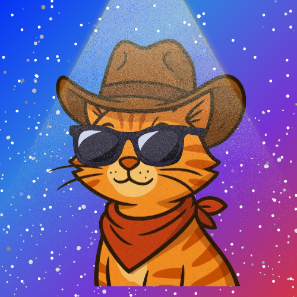

  

<h1 align="center">⚡ Gustavo D. Costa ⚡</h1>

  <em>Backend dev ⚙️ C Zig Golang</em> 
  Crafting secure tools, reverse engineering reality, and building open-source with a personal twist 🧠 
  <strong>"I am loosing my mind" 🔥</strong>

---

### 🧠 Projects I'm Brewing

- 🐚 **Pipwn-shell**: A custom Linux shell in raw C. Minimal. Powerful. Yours.  
- 🛡️ **PEchoPulse**: A lightweight chat app focused on minimalism, security and privacy. 
- 🧠 **GoBrainz**: CLI brain syncing with Notion AI.

---

### 🌱 Currently Learning
Cybersecurity • Memory Management • Low-level Systems • Reverse Engineering • Protocol Design 

---

### 🦾 What do I have to offer?
  
   • Analytic thinking  
   • Critical thinking  
   • Problem solving  
   • Teamwork...  

---

### 🧰 Tech Stack

  
  
  
  
  
  
  

---

### 📊 GitHub Stats

  

  

---

### 💣 Fun Facts

- 🧠 I am funny  
- 🛠️ I break things, fix them, and call it innovation.  
- ☕ I need money  
- 🧑‍🚀 Goal: Cyberdefender. Open source builder. Terminal sorcerer.

---

### 🧠 Quote That Fuels Me

> "Those who can make you believe absurdities can make you commit atrocities."  
> — *Voltaire*

---

### 🔗 Connect with Me

  
  

---